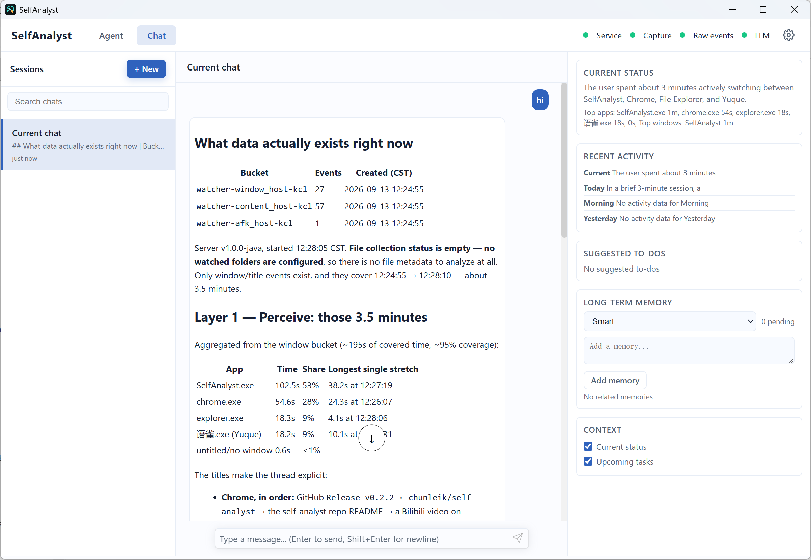

# SelfAnalyst

**English** | [简体中文](README.zh-CN.md)

[Website](https://chunleik.github.io/self-analyst/en/) · [Website preview and deployment (Chinese)](docs/website.md)

SelfAnalyst is a local-first tool for analyzing personal activity. It records foreground apps,
window titles, and activity times to help you review your day. Connect a language model to
summarize activities, organize your work history, and ask follow-up questions in chat.



> This screenshot shows the desktop chat interface: the session list, conversation area, and a
> side panel with current status, recent activity, suggested to-dos, long-term memory, and context options.

## Quick start

The desktop release is currently available for **Windows 10/11**. A macOS package is not yet available.

1. Download the installer or portable ZIP from [GitHub Releases](https://github.com/chunleik/self-analyst/releases).
2. Install the app, or extract the ZIP and run `SelfAnalyst.exe`. Release packages include a Java runtime; the development tools below are not required.
3. Open Settings in the upper-right corner, enter your service URL, API key, and model in **Model settings**, then choose **Save and apply**. See the [model settings guide (Chinese)](docs/llm-settings.md).
4. Review activities in **Dashboard**, or ask a question in **Chat**, such as "What did I mainly work on today?"

Local services can start without a configured model; chat and model-generated summaries need a working
model connection. Activity data is stored locally. Model requests send the required inputs to your
configured service; see the [privacy statement (Chinese)](PRIVACY.md).
Closing the window keeps the app running in the system tray; use the tray menu to quit completely.
The Help menu provides the user guide, issue reporting, and manual update checks.

The desktop title bar places **Help** beside SelfAnalyst, with **User guide**, **Report an issue**,
**Check for updates**, and **About SelfAnalyst**. The navigation row starts with Dashboard and Chat without repeating
the app name. Closing the desktop window keeps it running in the system tray.

**Check for updates** compares your desktop version with the latest stable release and shows the result
in the app. If an update is available, **Go to download** opens its release page so you can choose an
installer or portable package. Failed checks can be retried. Checks only run when requested; the app
does not automatically download or install updates. About information is available from Help; the tray
menu no longer includes About.

The Web version keeps the app name in its navigation row and places Help next to Settings.
Guides and issue reporting open in a browser tab; no activity data is attached or submitted.
In the Web version, Check for updates offers the release page because it cannot determine your installed desktop version.
Use Tab to focus Help, Enter to open it, arrow keys to select an item, and Esc to close it.

## Features

- **Activity review**: Explore current, daily, and historical activities on the dashboard timeline, then ask follow-up questions with context from an entry.
- **Images in chat**: Select or paste PNG/JPEG images for a model that supports image input. Each turn allows up to 4 images, each limited to 5 MiB and 20 megapixels. Images are stored with the conversation and sent to your configured model when submitted; this does not enable background screenshots.
- **Generated files**: Ask for spreadsheets, documents, presentations, or HTML/SVG, then save or download them from file cards in chat.
- **Long-term memory**: Automatically retain useful information and ask the assistant to correct or forget it in chat.

## Development requirements

- JDK 21
- Maven 3.9+
- Node.js 20+ for desktop development
- Rust stable and Cargo for the Tauri shell and accessibility sidecar
- Windows 10/11 for the full desktop experience

## Build and test

```powershell
mvn test
mvn package -DskipTests
cargo test --manifest-path self-analyst-axsidecar/Cargo.toml
```

Desktop development:

```powershell
Set-Location self-analyst-desktop
pnpm install
pnpm tauri dev
```

Build a local distribution:

```powershell
.\scripts\build-dist.ps1
```

Build a single portable package with a jlink JRE:

```powershell
.\scripts\build-portable.ps1
```

Build an NSIS installer with the same backend and jlink JRE:

```powershell
.\scripts\build-installer.ps1
```

Output is written to `artifacts/`, with `.sha256` files for the ZIP archive and installer.
Both the installer and portable ZIP store runtime data in `%LOCALAPPDATA%\com.selfanalyst.desktop`
by default and continue using the same directory after upgrades or extraction to a different location.
The portable package uses `data/` next to the executable only when a regular file named
`portable.marker` exists in the same directory as the EXE.
Existing compatible data without a marker is checked without modification before a marker is added
in place; data from other directories is not moved automatically. See the [runtime data guide](docs/runtime-storage.md).

## Interface language

Chinese and English are currently available. The default follows the system language, falling
back to English for unsupported languages. Select a language in desktop Settings, or configure it directly:

```toml
[app]
language = "en" # auto, zh, or en
```

The language selection is saved together with other configuration edits. After saving, quit from
the system tray and restart the application. Closing the window only hides it to the tray; it
does not restart the application. If you run the Java backend separately, restart it and refresh
the page. The interface, native menus, and prompts for newly generated content use the same
effective language. Existing conversations, summaries, and user-provided text remain unchanged.

If a configuration draft uses complex TOML syntax and the language field cannot be located
safely, the language selector is disabled; use the raw text editor instead. Before the backend
is ready, the page shows English loading messages, while native startup-error messages follow
the system language.

## Core modules

| Module | Responsibility |
|--------|----------------|
| `self-analyst-events` | Embedded event service, event policies, and historical data migration |
| `self-analyst-content` | Foreground windows, temporary UIA queries, and context-title extraction |
| `self-analyst-file` | Filesystem metadata such as names, paths, sizes, and timestamps within user-configured folders |
| `self-analyst-wiki` | Time-based aggregation, summaries, and indexing of title facts |
| `self-analyst-app` | Startup orchestration, Agent, and desktop API/UI |
| `self-analyst-axsidecar` | Windows UIAutomation Rust sidecar |
| `self-analyst-desktop` | Tauri desktop shell |

## Data boundaries

- Content events allow only the v2 title-field allowlist. `text_content`, `uia_text`, `raw_tree`, body text, and screenshots are not allowed.
- Failed UIA queries fall back to system window titles, without screenshot or OCR fallback.
- Sensitive applications are excluded from UIA queries.
- The file module collects only filesystem metadata: names, paths, sizes, and creation/modification
  times. Apart from safely parsing `.gitignore`, it does not read ordinary file contents, calculate
  content hashes, or generate summaries, topics, or vectors.

The embedded event service stores merged activity intervals, following ActivityWatch-style heartbeat
merging. Repeated unchanged heartbeats extend one event instead of creating permanent raw copies.
The event database is authoritative: back it up regularly. Raw heartbeat queries, exports, and replay
are retired. Collection stops below the disk-space blocking threshold; history is not automatically deleted.

See [PRIVACY.md](PRIVACY.md) for privacy details and [docs/README.md](docs/README.md) for the current
specification index. These documents are maintained in Simplified Chinese.

## Configuration

Desktop Settings opens a dedicated “Model settings” view by default. It supports one
OpenAI-compatible connection, connection presets, a write-only API key field, model discovery
and manual entry, temperature, and a generation test using a short prompt. After saving,
new chats and summary jobs use the new configuration, while responses already in progress
continue using the previous version. Summaries and compaction retain their low-temperature
policy; sessions and usage counters are not reset. See the [model settings guide](docs/llm-settings.md)
for instructions.

“Advanced configuration” retains the raw TOML editor. The model form updates only the specified
keys, preserving other configuration and comments. Complex syntax that cannot be safely updated
requires advanced configuration. The legacy generic structured API and Agent configuration tools
may still regenerate the TOML file. Switching views prompts for confirmation if there are unsaved changes.

Settings is organized into three tabs: **Model settings**, **Advanced configuration**, and
**Runtime data**. Both editors keep their save and discard actions visible while scrolling.
Runtime data shows the actual runtime and data directories, storage usage by category, and
migration backup cleanup with confirmation. Directory opening is available in the desktop app;
the browser shows the path instead. The model form can reveal only a newly entered API key,
and model discovery offers clickable candidates as well as manual entry.

Explicit TOML values take precedence over environment variables. Removing an override restores
fallback to environment variables and defaults; an explicitly empty key prevents environment
fallback. Leaving the password field blank keeps the current key. “Clear key” and “Restore key
inheritance” are separate actions, each requiring confirmation. Configuration sources and runtime
status are shown in the interface. Refer to the [user configuration specification](openspec/specs/user-configuration/spec.md)
and `SupportedKeys` for supported keys. An explicit JVM property takes precedence for `memory.dir`;
`events.port` does not accept an environment variable.

The keys that can be updated without restarting are `llm.api-key`, `llm.base-url`, `llm.model`,
and `llm.temperature`. Ports, budgets, `maxIters`, compaction thresholds, and the
Embedding client continue using their startup configuration. Changes to a key inherited by the
Embedding client trigger a separate restart notice. Local services can still start without a
configured model; after completing the model settings, new work can resume without restarting.

Chat, summaries, and generation tests do not send output limit parameters such as `max_tokens`.
The model service still applies its own limits. The retired `llm.max-tokens` setting and
`LLM_MAX_TOKENS` environment variable are ignored; existing TOML lines are preserved. Daily
budgets, usage metering, iteration limits, and context compaction remain in effect.

The generation test sends a fixed short prompt; usage and charges depend on the model service. Neither this
test nor model discovery saves the configuration. The legacy LLM check in advanced configuration
only verifies connectivity to the model catalog. A successful save does not guarantee that the
remote model can be called, and a successful test does not change the runtime configuration.
External file edits are not automatically applied at runtime; save through the application or
restart the backend. For concurrent updates to the same field, the last committed update wins.

| Configuration key | Environment variable | Default |
|-------------------|----------------------|---------|
| `llm.base-url` | `LLM_BASE_URL` | `https://api.openai.com/v1` |
| `llm.model` | `LLM_MODEL` | `gpt-4o` |
| `llm.api-key` | `OPENAI_API_KEY` | Empty |
| `events.mode` | `EVENTS_MODE` | `embedded` |
| `events.port` | None (`config.toml` only) | `5700` |
| `events.collection.title.enabled` | `EVENTS_COLLECTION_TITLE_ENABLED` | `true` |
| `events.raw.dir` | `EVENTS_RAW_DIR` | `{events.data-dir}/raw` |
| `events.export.maxRangeDays` | `EVENTS_EXPORT_MAX_RANGE_DAYS` | `31` |
| `events.storage.lowDisk.warnBytes` | `EVENTS_STORAGE_LOW_DISK_WARN_BYTES` | `10737418240` |
| `events.storage.lowDisk.blockBytes` | `EVENTS_STORAGE_LOW_DISK_BLOCK_BYTES` | `1073741824` |
| `wiki.summary.periodMaxCalls` | `WIKI_SUMMARY_PERIOD_MAX_CALLS` | `12` |
| `wiki.summary.periodMaxTokens` | `WIKI_SUMMARY_PERIOD_MAX_TOKENS` | `256000` |
| `wiki.summary.outputTokenReserve` | `WIKI_SUMMARY_OUTPUT_TOKEN_RESERVE` | `4096` |

Existing two-layer data is migrated to a verified compact database while legacy backups are retained.
Settings show active and backup space separately; explicitly cleaning migration backups releases the
old files and removes per-heartbeat recovery and rollback. Submission IDs are deduplicated for 24 hours.
`events.raw.*` settings are retired; `events.raw.dir` is retained only to locate migration input.
See [storage and recovery guidance](docs/runtime-storage.md) before downgrading.

## Documentation

The following documents are maintained in Simplified Chinese:

- [Model settings guide](docs/llm-settings.md)
- [Chat image input specification](openspec/specs/chat-image-input/spec.md)
- [Desktop chat and generated files specification](openspec/specs/desktop-chat/spec.md)
- [Help and updates specification](openspec/specs/desktop-help/spec.md)
- [Architecture](docs/architecture.md)
- [Documentation and specification index](docs/README.md)
- [Testing and integration verification](docs/testing.md)
- [Context-title collection specification](openspec/specs/title-capture/spec.md)
- [Title-minimized persistence specification](openspec/specs/content-event-persistence/spec.md)
- [Temporary removal of OCR and audio modules](docs/archive/removed-features/removed-ocr-audio.md)
- [Privacy](PRIVACY.md)

## Long-term memory and clarification in chat

Long-term memory is summarized and filtered automatically in the background by default, and the chat
page no longer shows an approval panel. Information with lasting value and sufficient evidence is
saved automatically; credentials, sensitive inferences, low-confidence content, and one-off activity
logs are filtered out. Previously pending memories are reassessed in the background after startup:
qualifying entries become active, while the rest are deleted. If the model or a save operation fails,
the original records are retained for a later retry. Sessions with automatic summarization explicitly
disabled remain disabled, and the legacy confirm-all policy is treated as automatic filtering.

If a memory is inaccurate, you can say, "You remembered that incorrectly; I am now maintaining a
different project," or "Forget the memory about this project." The assistant asks a follow-up question
when the target is unclear. Once the target is clear, it corrects or disables the relevant memory and
confirms completion only after saving successfully. Explicit corrections also work in sessions with
automatic summarization disabled.

## Activity statistics

Dashboard and Wiki days run from **04:00 to 04:00 the next day in the local time zone**.
Activity before 04:00 belongs to the previous statistical day; weeks start Monday at 04:00
and months start on their first day at 04:00. Morning covers 04:00–12:00. The current
window remains approximately two hours, and the dashboard's last two weeks remain a rolling 14 days.

Application durations are clipped to the requested interval and exclude overlapping AFK (idle)
time. Unidentified application activity is shown separately and does not determine the leading
application. Missing AFK coverage is explicitly shown as an estimate. Old summary caches are
refreshed; outdated Wiki summaries are retained for traceability and excluded from current results.
Historical regeneration runs in the background when Wiki backfill is enabled and follows the
existing model budget and retry settings. Original events remain unchanged.

Wiki's structured title facts use a default budget of **24,000 characters**
(`wiki.prompt.maxContentChars`), excluding fixed prompts and aggregate metrics.
Explicit valid settings take precedence, so an existing 12,000-character budget remains effective.
New Wiki summaries focus on tasks, projects, and technical topics. Activity durations and AFK
coverage remain in structured statistics for internal prioritization and confidence assessment;
they are not repeated in summary text or task evidence. Existing summaries and dashboard statistics
remain available.

New summaries link tasks to title evidence and distinguish observations from inferences; window
titles cannot establish that a task was completed. Application names and displayed evidence are
derived locally from validated references, so the model does not need to repeat them. The dashboard's
current window and today use the same title facts, with a smaller budget and a five-second model timeout.

Long Wiki inputs are organized into topic candidates and summarized within `wiki.summary.maxCalls`
(default **6** per generation attempt) and `wiki.summary.maxRequestChars` (default **32,000**, including
system instructions). Short inputs still use one call. Related topics can span applications and time
periods; topic membership remains a model classification. Reports distinguish input omissions,
unassigned facts, topic cards retained or omitted during merging, and the small set of displayed
evidence references. These counts do not prove that every real task was captured correctly.

Each logical Wiki period has a lifetime allowance of **12 calls** and **256,000 tokens** for admission across
retries, restarts, date changes, and changes to the input or model. Before a request, the local ledger
reserves the estimated input plus **4,096 output tokens**. This is an admission estimate, not a
`max_tokens` parameter or a guarantee about the provider's final bill. Actual usage replaces the
reservation when available; failed or interrupted calls with unknown usage retain a conservative
token reservation. The existing global daily budget remains separate. When the period allowance is exhausted,
generation pauses with a visible reason and usage; raising the relevant `wiki.summary.periodMaxCalls`
or `wiki.summary.periodMaxTokens` setting and restarting can resume it without clearing past usage.
Waiting until the next day does not reset the period allowance.

Validated leaf, merge, and final results survive restarts in `{memory.dir}/wiki-generation.db`.
Compatible retries reuse completed work; a final result awaiting publication can be saved to the
Wiki without another model request. Input, model and generation versions isolate incompatible
checkpoints. Published checkpoints become eligible for cleanup after **7 days**; unfinished work
and cumulative usage remain available for recovery. Existing Wiki summaries are not automatically regenerated.
See the [summary quality evaluation guide](docs/summary-quality-evaluation.md) for reproducible,
synthetic-data comparisons and the limitations of automatic quality measurements.

See the [activity statistics guide](docs/activity-statistics.md) for migration and recovery details.

## Contributing

Bug reports, feature suggestions, and pull requests are welcome. The project follows specification-driven
development, with `openspec/specs/` as the authoritative source of behavior contracts and strict
boundaries for collection and persistence. Read the [contribution guide](CONTRIBUTING.md) before
making changes, especially its sections on data boundaries and the specification-driven workflow.

- [Contribution guide](CONTRIBUTING.md)
- [Code of conduct](CODE_OF_CONDUCT.md)
- [Security policy](SECURITY.md) — Report vulnerabilities privately rather than opening public issues.

## License

This project is licensed under the [Apache License 2.0](LICENSE). See also [NOTICE](NOTICE).
Third-party components used by the project or included in release distributions, along with their
licenses, are listed in [THIRD-PARTY-NOTICES.md](THIRD-PARTY-NOTICES.md).
