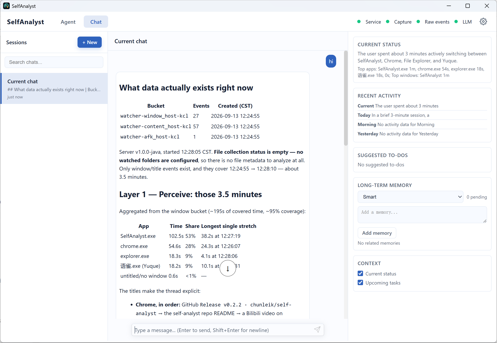

# SelfAnalyst

**English** | [简体中文](README.zh-CN.md)

[Website](https://chunleik.github.io/self-analyst/en/) · [Releases](https://github.com/chunleik/self-analyst/releases)

SelfAnalyst is a local-first tool for analyzing personal activity. It records foreground apps,
window titles, and activity times to help you review your day. Connect a language model to
summarize activities, organize your work history, and ask follow-up questions in chat.



## Quick start

The desktop release is currently available for **Windows 10/11**. A macOS package is not yet available.

1. Download the installer or portable ZIP from [GitHub Releases](https://github.com/chunleik/self-analyst/releases).
2. Install the app, or extract the ZIP and run `SelfAnalyst.exe`. Release packages include a Java runtime; no development tools are required.
3. Open Settings in the upper-right corner, enter your service URL, API key, and model in **Model settings**, then choose **Save and apply**. See the [model settings guide (Chinese)](docs/llm-settings.md).
4. Review activities in **Dashboard**, or ask a question in **Chat**, such as "What did I mainly work on today?"

Good to know:

- Local services start without a configured model; chat and model-generated summaries need a working model connection.
- Closing the window keeps the app running in the system tray. Use the tray menu to quit completely.
- Runtime data is stored in `%LOCALAPPDATA%\com.selfanalyst.desktop` and survives upgrades. See the [runtime data guide (Chinese)](docs/runtime-storage.md) for portable mode, backup, and recovery.

## Features

- **Activity review**: Explore current, daily, and historical activities on the dashboard timeline. Available overviews are shown in full without expanding an entry, with topic titles underneath; expand to read each saved topic’s full title and narrative in order, or ask follow-up questions with context. Empty evidence sections are hidden. A day runs from 04:00 to 04:00 the next day in local time; see the [activity statistics guide (Chinese)](docs/activity-statistics.md).
- **Personal knowledge**: Connect activity across days and apps to stable projects, topics, and goals in **Knowledge**. Confirm, remove, or correct associations; your decisions survive rebuilding and restarting. Knowledge works locally without extra model calls. See the [personal knowledge guide (Chinese)](docs/personal-ontology.md).
- **Optional Neo4j sync**: Manually publish the current, corrected knowledge graph to a Neo4j database you configure. It is off by default and requires destination, namespace, and data-scope confirmation for every sync. Local storage remains authoritative. See the [setup and read-only query guide (Chinese)](docs/neo4j-sync.md).
- **Images in chat**: Select or paste PNG/JPEG images for a model that supports image input, up to 4 images per turn, each limited to 5 MiB and 20 megapixels. This does not enable background screenshots.
- **Generated files**: Ask for spreadsheets, documents, presentations, or HTML/SVG, then save or download them from file cards in chat. See the [document generation guide (Chinese)](docs/document-generation.md).
- **Long-term memory**: Useful information is retained automatically; credentials, sensitive inferences, and one-off activity are filtered out. Ask the assistant in chat to correct or forget a memory.
- **Help and updates**: The **Help** menu provides the user guide, issue reporting, and **Check for updates**. Checks run only when requested; the app never downloads or installs updates automatically.
- **Interface language**: Chinese and English, following the system language by default. Change it in Settings or with `app.language` (`auto`, `zh`, or `en`), then restart the app.

## Privacy and data boundaries

Activity data is stored locally. Model requests send only the required inputs to the service you
configure. Optional, explicitly confirmed Neo4j sync sends a bounded knowledge-graph snapshot to your
chosen database; it can include private titles, descriptions, and evidence. See the [privacy statement (Chinese)](PRIVACY.md).

- Content events store only allowlisted title fields. Body text, UIA text, control trees, screenshots, OCR, and audio are never stored.
- Failed UIA queries fall back to system window titles. Sensitive applications are excluded from UIA queries.
- File collection is limited to filesystem metadata (names, paths, sizes, and timestamps) in folders you configure. Apart from safely parsing `.gitignore`, it does not read file contents, calculate content hashes, or generate summaries, topics, or vectors.
- Before titles reach the model, private IPv4 addresses, meeting numbers, and account-verification pages are masked, and private-browsing titles are skipped. A private window that exposes no marker cannot be detected, so list sensitive apps and sites in `wiki.privacy.excludeApps` (comma-separated executable names such as `weixin.exe`) and `wiki.privacy.excludeSites`, then restart the backend.
- The event database stores merged activity intervals and is authoritative; back it up regularly. Collection stops when disk space falls below the blocking threshold; history is never deleted automatically.
- Neo4j configuration saves and status checks never connect to Neo4j. Disabling sync does not erase the remote copy; source removals reach it only on the next successful manual sync. Changing namespaces leaves the old namespace in place.

## Configuration

Settings has three tabs: **Model settings** (one OpenAI-compatible connection, with presets, model
discovery, and a generation test), **Advanced configuration** (the raw TOML editor), and
**Runtime data** (directories, storage usage, and migration backup cleanup).

Explicit TOML values take precedence over environment variables, which take precedence over defaults.
Changes to `llm.api-key`, `llm.base-url`, `llm.model`, and `llm.temperature` apply to new chats and
summary jobs without restarting. Saved `neo4j.*` settings apply to the next manual sync without
restarting or sending data. Other restart-required keys are identified in Settings. External edits to the TOML
file are not applied until you save through the app or restart the backend.

| Configuration key | Environment variable | Default |
|-------------------|----------------------|---------|
| `llm.base-url` | `LLM_BASE_URL` | `https://api.openai.com/v1` |
| `llm.model` | `LLM_MODEL` | `gpt-4o` |
| `llm.api-key` | `OPENAI_API_KEY` | Empty |
| `events.mode` | `EVENTS_MODE` | `embedded` |
| `events.port` | None (`config.toml` only) | `5700` |
| `wiki.privacy.excludeApps` | None (`config.toml` only) | Empty |
| `wiki.privacy.excludeSites` | None (`config.toml` only) | Empty |
| `neo4j.enabled` | None (`config.toml` only) | `false` |
| `neo4j.uri` | None (`config.toml` only) | Empty |
| `neo4j.database` | None (`config.toml` only) | `neo4j` |
| `neo4j.username` | None (`config.toml` only) | `neo4j` |
| `neo4j.password-env` | Names the password environment variable; never the password | `SELF_ANALYST_NEO4J_PASSWORD` |
| `neo4j.namespace` | None (`config.toml` only) | Empty; required, exclusive to one local dataset |
| `neo4j.timeout-seconds` | None (`config.toml` only) | `15` (range: `1`–`120`) |

For Neo4j, set the password in the environment inherited by the app before starting it; never put
the password in TOML or the URI. Changing that process environment requires restarting the app.
Unencrypted connections allow only `bolt://` on `localhost`, `127.0.0.1`, or `[::1]`; remote targets
require `bolt+s://` or `neo4j+s://` with a valid CA-trusted certificate. Plain `neo4j://`, `+ssc`,
embedded credentials, paths (including a trailing slash), queries, and fragments are rejected.
Use a namespace unique to this local dataset. In **Settings → Neo4j sync**, review the scope
and destination, then choose **Confirm and sync…**. The configured account needs graph-write,
constraint-creation, and `SHOW CONSTRAINTS` permissions; setup details and safe Cypher examples are in the [Neo4j guide (Chinese)](docs/neo4j-sync.md).

See the [model settings guide (Chinese)](docs/llm-settings.md) and the
[user configuration specification (Chinese)](openspec/specs/user-configuration/spec.md) for all
supported keys, and the [architecture document (Chinese)](docs/architecture.md) for summary budgets and limits.

## Development

Requirements: JDK 21, Maven 3.9+, Node.js 20+ for desktop development, Rust stable and Cargo for the
Tauri shell and accessibility sidecar, and Windows 10/11 for the full desktop experience.

```powershell
mvn test                                                        # JUnit and desktop UI tests
mvn package -DskipTests                                         # build JARs
cargo test --manifest-path self-analyst-axsidecar/Cargo.toml    # Rust sidecar tests

Set-Location self-analyst-desktop; pnpm install; pnpm tauri dev # run the desktop shell

.\scripts\build-dist.ps1                                        # local distribution
.\scripts\build-portable.ps1                                    # portable ZIP with a jlink JRE
.\scripts\build-installer.ps1                                   # NSIS installer
```

Build output is written to `artifacts/`, with `.sha256` files for the ZIP archive and installer.

| Module | Responsibility |
|--------|----------------|
| `self-analyst-events` | Embedded event service, event policies, and historical data migration |
| `self-analyst-content` | Foreground windows, temporary UIA queries, and context-title extraction |
| `self-analyst-file` | Filesystem metadata within user-configured folders |
| `self-analyst-wiki` | Time-based aggregation, summaries, and indexing of title facts |
| `self-analyst-ontology` | Typed entities, evidence-backed relationships, corrections, and local knowledge queries |
| `self-analyst-app` | Startup orchestration, Agent, and desktop API/UI |
| `self-analyst-axsidecar` | Windows UIAutomation Rust sidecar |
| `self-analyst-desktop` | Tauri desktop shell |

## Documentation

The following documents are maintained in Simplified Chinese:

- [Documentation and specification index](docs/README.md)
- [Architecture](docs/architecture.md)
- [Optional Neo4j sync and read-only queries](docs/neo4j-sync.md)
- [Testing and integration verification](docs/testing.md)
- [Summary quality evaluation](docs/summary-quality-evaluation.md)
- [Website preview and deployment](docs/website.md)
- [0.6.0 release notes](docs/releases/v0.6.0.md)

## Contributing

Bug reports, feature suggestions, and pull requests are welcome. The project follows specification-driven
development, with `openspec/specs/` as the authoritative source of behavior contracts. Read the
[contribution guide](CONTRIBUTING.md) before making changes, and see the
[code of conduct](CODE_OF_CONDUCT.md). Report vulnerabilities privately as described in the
[security policy](SECURITY.md) rather than opening public issues.

## License

This project is licensed under the [Apache License 2.0](LICENSE). See also [NOTICE](NOTICE) and
[THIRD-PARTY-NOTICES.md](THIRD-PARTY-NOTICES.md).
