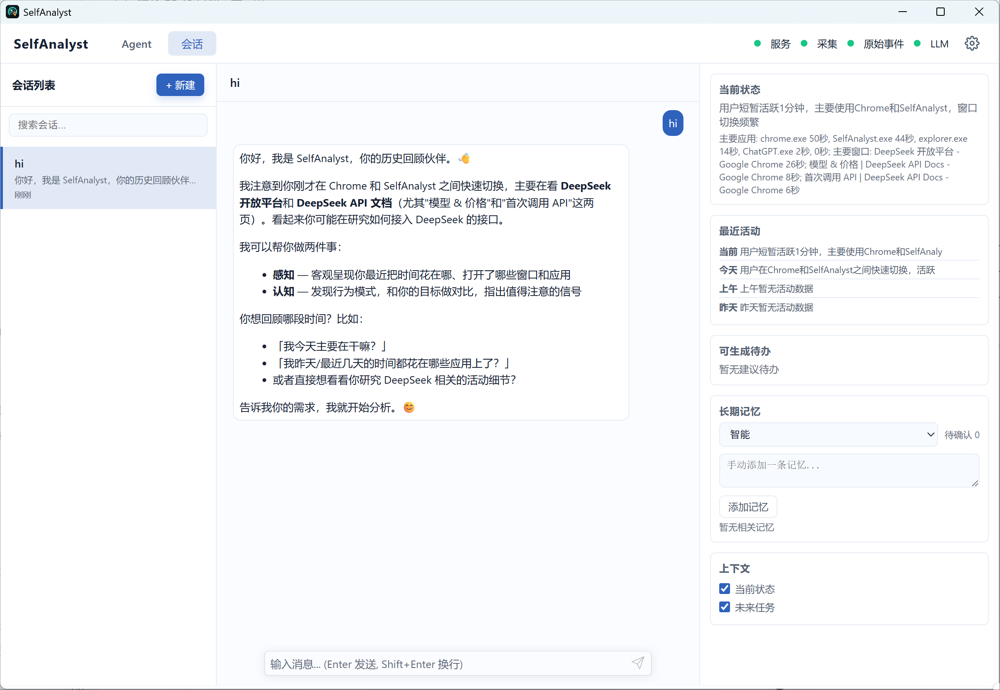

# SelfAnalyst

[English](README.md) | **简体中文**

SelfAnalyst 是一个本地优先的个人活动分析工具。窗口/AFK 状态与应用内上下文标题由本地
事件服务存储并供 Wiki 聚合；用户显式配置目录中的文件系统元数据则由本地文件存储、
FileTools 和桌面 API 提供查询，并以 metadata-only heartbeat 留存在本地事件历史中。



> 上图是桌面端会话页的实际运行截图，展示会话列表、对话区，以及包含当前状态、最近活动、
> 可生成待办、长期记忆与上下文选项的右侧面板。

嵌入式事件服务模式会先把每次通过隐私校验的原始事件永久、只追加地写入 UTC 月度
SQLite 分区，再生成可合并、可重建的 `events.db` 投影。外部 ActivityWatch 模式不提供这项永久保留
保证。磁盘低于阻断阈值时系统拒绝新采集，不会自动删除最旧分区。

当前“内容采集”的严格定义是标题采集：允许在识别时临时读取完整 UIA 控件树，但最终只保存
系统窗口标题、微信对话人、文章/文档/页面标题及来源、置信度和时间等元数据，禁止保存 UIA 正文。

## 环境要求

- JDK 21
- Maven 3.9+
- Node.js 20+（桌面端开发）
- Rust stable 与 Cargo（Tauri 壳和 accessibility sidecar）
- Windows 10/11（当前完整桌面体验）

## 构建与测试

```powershell
mvn test
mvn package -DskipTests
cargo test --manifest-path self-analyst-axsidecar/Cargo.toml
```

桌面端开发：

```powershell
Set-Location self-analyst-desktop
pnpm install
pnpm tauri dev
```

构建本机发布目录：

```powershell
.\scripts\build-dist.ps1
```

构建包含 jlink JRE 的单一便携包：

```powershell
.\scripts\build-portable.ps1
```

构建包含同一后端与 jlink JRE 的 NSIS 安装包：

```powershell
.\scripts\build-installer.ps1
```

输出位于 `artifacts/`，并为 ZIP 和安装包生成 `.sha256` 文件。安装模式把用户数据保存在 Tauri
当前用户应用数据目录，不随应用文件升级或卸载；便携模式继续把 `data/` 放在可执行文件旁边。
发布包不包含 PaddleOCR、Tesseract、Whisper 或语音模型。

## 界面语言

当前提供中文和 English，默认跟随系统语言，不支持的系统语言回退英文。打开桌面设置可选择语言，也可在配置文件中设置：

```toml
[app]
language = "en" # auto、zh 或 en
```

语言选择和其他编辑一起保存。保存后需从托盘退出并重新启动应用；仅关闭窗口会隐藏到托盘，不会重启。独立运行 Java 后端时，需重启后端并刷新页面。界面、原生菜单和新生成内容的提示词会采用同一有效语言，历史会话、已有摘要和用户原文保持原样。

配置草稿采用复杂 TOML 语法、无法安全定位语言字段时，语言选择框会禁用，可直接使用原始文本编辑器。后端未就绪时，页面使用英文加载提示，原生启动失败提示按系统语言显示。

## 核心模块

| 模块 | 职责 |
|------|------|
| `self-analyst-events` | 嵌入式事件服务、事件策略和历史迁移 |
| `self-analyst-content` | 前台窗口、UIA 临时查询和上下文标题提取 |
| `self-analyst-file` | 用户显式配置目录中的文件名、路径、大小和时间等元数据 |
| `self-analyst-wiki` | 标题事实的时间聚合、摘要和索引 |
| `self-analyst-app` | 启动编排、Agent、桌面 API/UI |
| `self-analyst-axsidecar` | Windows UIAutomation Rust 边车 |
| `self-analyst-desktop` | Tauri 桌面壳 |

## 数据边界

- 内容事件只允许 v2 标题白名单字段，不允许 `text_content`、`uia_text`、`raw_tree`、正文或截图。
- UIA 查询失败时退回系统窗口标题，不使用截图/OCR 回退。
- 敏感应用会跳过 UIA 查询。
- 文件模块只采集文件名、路径、大小和创建/修改时间等文件系统元数据；除安全解析 `.gitignore` 外，
  不读取普通文件正文，不计算内容哈希，也不生成摘要、主题或向量。

隐私细节见 [PRIVACY.md](PRIVACY.md)，现行规格索引见 [docs/README.md](docs/README.md)。

## 配置

首次启动会在数据目录创建 `config.toml`。桌面“配置”页可编辑当前受支持字段；显式保存的 TOML 配置优先于
环境变量，未配置的键才使用环境变量兜底，最后使用内置默认值。删除配置项可恢复兜底。
memory.dir 的显式 JVM 参数仍具有最高优先级；events.port 不接受环境变量覆盖。完整键表以 [用户配置规格](openspec/specs/user-configuration/spec.md) 和 `SupportedKeys` 为准。

在桌面配置页或 Agent 配置工具中保存以下参数后，新一轮聊天及新摘要任务立即采用新配置：
llm.api-key、llm.base-url、llm.model、llm.temperature、llm.max-tokens。正在进行的一轮聊天（包括上下文
压缩和工具调用）继续使用原配置，历史与当日用量不会重置。摘要与压缩仍保持低温策略。
首次未填写密钥也能启动本地服务，补填后可开始聊天；清空有效密钥后，新 LLM 工作显示未配置。

配置页显示已保存值、配置来源和生效状态。出现“新任务已生效，当前回答继续使用原配置”时无需重启；
“需要重启后端”仅针对所列组件。端口、存储目录、预算策略、maxIters、压缩阈值和 Embedding 客户端
仍按启动期配置处理；Embedding 继承 LLM 密钥时，密钥变化会单独提示其重启需求。
外部编辑器直接修改 TOML 不触发自动热更新，可在应用内保存或重启后端应用。
连接测试使用当前编辑文本，测试成功不代表运行配置已切换，也不保证所选模型能完成聊天。

| 配置键 | 环境变量 | 默认值 |
|--------|----------|--------|
| `llm.base-url` | `LLM_BASE_URL` | `https://api.openai.com/v1` |
| `llm.model` | `LLM_MODEL` | `gpt-4o` |
| `llm.api-key` | `OPENAI_API_KEY` | 空 |
| `events.mode` | `EVENTS_MODE` | `embedded` |
| `events.port` | —（仅 `config.toml`） | `5700` |
| `events.collection.title.enabled` | `EVENTS_COLLECTION_TITLE_ENABLED` | `true` |
| `events.raw.dir` | `EVENTS_RAW_DIR` | `{events.data-dir}/raw` |
| `events.raw.query.maxRangeDays` | `EVENTS_RAW_QUERY_MAX_RANGE_DAYS` | `31` |
| `events.raw.query.maxPageSize` | `EVENTS_RAW_QUERY_MAX_PAGE_SIZE` | `1000` |
| `events.raw.lowDisk.warnBytes` | `EVENTS_RAW_LOW_DISK_WARN_BYTES` | `10737418240` |
| `events.raw.lowDisk.blockBytes` | `EVENTS_RAW_LOW_DISK_BLOCK_BYTES` | `1073741824` |
| `events.raw.integrity.startupScope` | `EVENTS_RAW_INTEGRITY_STARTUP_SCOPE` | `latest` |
| `events.raw.projector.batchSize` | `EVENTS_RAW_PROJECTOR_BATCH_SIZE` | `1000` |

嵌入式模式的永久原始层固定启用，不支持 TTL、最大分区数或自动删除配置。产生分区后，普通配置
保存不能修改 `events.raw.dir`；目录迁移需要独立的显式转存流程。

[移除说明](docs/archive/removed-features/removed-ocr-audio.md) 中列出的旧 OCR 键和所有 `aw.audio.*` 不再是受支持配置。
加载旧文件时这些键不会导致启动失败，但不会产生任何功能。


## 文档

- [架构](docs/architecture.md)
- [文档与规格索引](docs/README.md)
- [测试与集成验证](docs/testing.md)
- [上下文标题采集规格](openspec/specs/title-capture/spec.md)
- [标题最小化持久化规格](openspec/specs/content-event-persistence/spec.md)
- [OCR 与声音模块暂时移除说明](docs/archive/removed-features/removed-ocr-audio.md)
- [隐私说明](PRIVACY.md)

## 贡献

欢迎提交缺陷报告、功能建议和 PR。本项目采用规格驱动开发，行为契约以 `openspec/specs/`
为权威来源，并对采集与持久化范围有明确红线，动手前请先阅读
[贡献指南](CONTRIBUTING.md)，尤其是其中的数据边界红线与规格驱动流程两节。

- [贡献指南](CONTRIBUTING.md)
- [行为准则](CODE_OF_CONDUCT.md)
- [安全策略](SECURITY.md) — 安全漏洞请勿开公开 Issue，请走私密报告渠道

## 许可证

本项目采用 [Apache License 2.0](LICENSE)，另见 [NOTICE](NOTICE)。依赖与随发布产物分发的
第三方组件及其各自许可证见 [THIRD-PARTY-NOTICES.md](THIRD-PARTY-NOTICES.md)。
