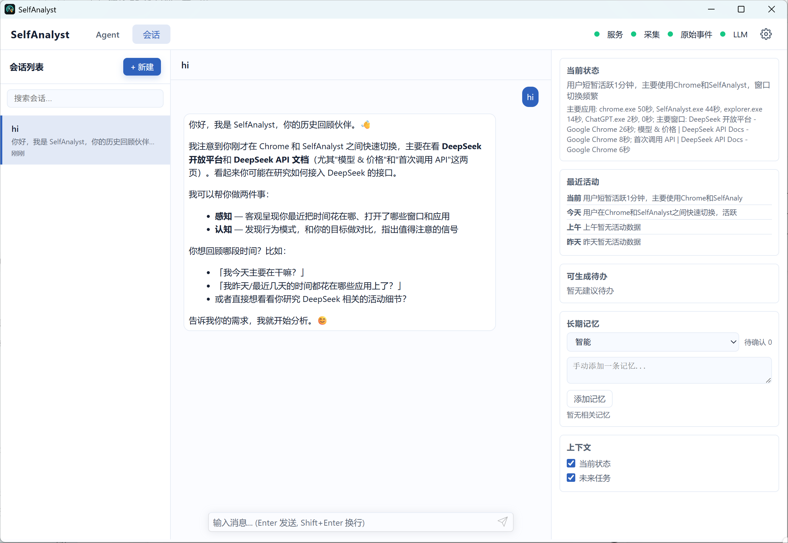

# SelfAnalyst

[English](README.md) | **简体中文**

[官网](https://chunleik.github.io/self-analyst/zh-CN/) · [下载](https://github.com/chunleik/self-analyst/releases)

SelfAnalyst 是一个本地优先的个人活动分析工具。它记录前台应用、窗口标题和活动时间，
帮助你回顾一天的工作；配置大模型后，还可以总结活动、归纳工作内容，并通过对话继续追问。



## 快速开始

当前提供 **Windows 10/11** 桌面版，尚未提供 macOS 安装包。

1. 前往 [GitHub Releases](https://github.com/chunleik/self-analyst/releases)，下载安装包或免安装 ZIP。
2. 完成安装，或解压 ZIP 后运行 `SelfAnalyst.exe`。发布包自带 Java 运行环境，无需安装开发工具。
3. 打开右上角配置入口，在“模型设置”中填写服务地址、API Key 和模型，点击“保存并应用”。详见[模型设置指南](docs/llm-settings.md)。
4. 在“看板”回顾活动，在“会话”中提问，例如“今天主要做了哪些工作？”。

使用须知：

- 未配置模型时也能启动本地服务；聊天和模型摘要需要可用的模型连接。
- 关闭窗口后应用继续在系统托盘运行；完全退出请使用托盘菜单。
- 运行数据保存在 `%LOCALAPPDATA%\com.selfanalyst.desktop`，升级后继续使用。便携模式、备份与恢复见[运行数据指南](docs/runtime-storage.md)。

## 主要功能

- **活动回顾**：通过看板时间轴查看当前、今天和历史活动，并带着条目上下文继续追问。统计日为本地时间 04:00 至次日 04:00，详见[活动统计说明](docs/activity-statistics.md)。
- **个人知识**：在“知识”中把跨日期、跨应用的活动关联到稳定的项目、主题和目标；确认、移除或改正关联，你的决定在重建和重启后保留。知识在本地工作，不额外调用模型。详见[个人知识指南](docs/personal-ontology.md)。
- **图片提问**：在会话中选择或粘贴 PNG/JPEG 图片，交给支持图片输入的模型分析；每轮最多 4 张，每张不超过 5 MiB 和 2000 万像素。不启用后台截屏。
- **生成文件**：让助手生成表格、文档、演示文稿或 HTML/SVG，通过会话文件卡片保存或下载。详见[文档生成指南](docs/document-generation.md)。
- **长期记忆**：自动保存有长期价值的信息，过滤凭据、敏感推断和一次性操作流水；可以在会话中要求更正或忘记。
- **帮助与更新**：“帮助”菜单提供使用指南、反馈问题和“检查更新”。仅在手动操作时检查，不自动下载或安装更新。
- **界面语言**：提供中文和 English，默认跟随系统语言。可在设置中选择，或配置 `app.language`（`auto`、`zh` 或 `en`），重启应用后生效。

## 隐私与数据边界

活动数据保存在本机，调用模型时只将所需输入发送到你配置的服务端，详见[隐私说明](PRIVACY.md)。

- 内容事件只保存白名单内的标题字段，不保存正文、UIA 文本、控件树、截图、OCR 或音频。
- UIA 查询失败时退回系统窗口标题；敏感应用会跳过 UIA 查询。
- 文件采集仅限你配置的目录内的文件系统元数据（文件名、路径、大小和时间）；除安全解析 `.gitignore` 外，不读取文件正文，不计算内容哈希，也不生成摘要、主题或向量。
- 标题送入模型前，会隐藏内网 IPv4 地址、会议号和账号验证页，并跳过带私人浏览标记的标题。没有任何标记的无痕窗口无法识别，请把敏感应用和网站加入 `wiki.privacy.excludeApps`（逗号分隔的可执行文件名，如 `weixin.exe`）和 `wiki.privacy.excludeSites`，然后重启后端。
- 事件库保存合并后的活动区间，是权威数据，需要定期备份。磁盘低于阻断阈值时停止新采集，不会自动删除历史活动。

## 配置

配置窗口分为三个页签：**模型设置**（一个 OpenAI-compatible 连接，支持连接预设、模型发现和生成测试）、
**高级配置**（TOML 原文编辑）和**运行数据**（目录、存储占用和迁移备份清理）。

显式 TOML 配置优先于环境变量，环境变量优先于默认值。`llm.api-key`、`llm.base-url`、`llm.model` 和
`llm.temperature` 修改后无需重启，新聊天和摘要任务即采用新配置；其他键在重启后生效。
外部修改 TOML 文件不会自动应用，需要在应用内保存或重启后端。

| 配置键 | 环境变量 | 默认值 |
|--------|----------|--------|
| `llm.base-url` | `LLM_BASE_URL` | `https://api.openai.com/v1` |
| `llm.model` | `LLM_MODEL` | `gpt-4o` |
| `llm.api-key` | `OPENAI_API_KEY` | 空 |
| `events.mode` | `EVENTS_MODE` | `embedded` |
| `events.port` | —（仅 `config.toml`） | `5700` |
| `wiki.privacy.excludeApps` | —（仅 `config.toml`） | 空 |
| `wiki.privacy.excludeSites` | —（仅 `config.toml`） | 空 |

完整键表见[模型设置指南](docs/llm-settings.md)和[用户配置规格](openspec/specs/user-configuration/spec.md)，
摘要预算与限制见[架构文档](docs/architecture.md)。

## 开发

环境要求：JDK 21、Maven 3.9+、Node.js 20+（桌面端开发）、Rust stable 与 Cargo（Tauri 壳和
accessibility sidecar），以及 Windows 10/11（完整桌面体验）。

```powershell
mvn test                                                        # JUnit 与桌面 UI 测试
mvn package -DskipTests                                         # 构建 JAR
cargo test --manifest-path self-analyst-axsidecar/Cargo.toml    # Rust 边车测试

Set-Location self-analyst-desktop; pnpm install; pnpm tauri dev # 运行桌面壳

.\scripts\build-dist.ps1                                        # 本机发布目录
.\scripts\build-portable.ps1                                    # 包含 jlink JRE 的便携 ZIP
.\scripts\build-installer.ps1                                   # NSIS 安装包
```

构建输出位于 `artifacts/`，并为 ZIP 和安装包生成 `.sha256` 文件。

| 模块 | 职责 |
|------|------|
| `self-analyst-events` | 嵌入式事件服务、事件策略和历史迁移 |
| `self-analyst-content` | 前台窗口、UIA 临时查询和上下文标题提取 |
| `self-analyst-file` | 用户显式配置目录中的文件系统元数据 |
| `self-analyst-wiki` | 标题事实的时间聚合、摘要和索引 |
| `self-analyst-ontology` | 类型化实体、带证据的关系、用户纠错与本地知识查询 |
| `self-analyst-app` | 启动编排、Agent、桌面 API/UI |
| `self-analyst-axsidecar` | Windows UIAutomation Rust 边车 |
| `self-analyst-desktop` | Tauri 桌面壳 |

## 文档

- [文档与规格索引](docs/README.md)
- [架构](docs/architecture.md)
- [测试与集成验证](docs/testing.md)
- [摘要质量评测](docs/summary-quality-evaluation.md)
- [官网预览与发布说明](docs/website.md)
- [0.6.0 发布说明](docs/releases/v0.6.0.md)

## 贡献

欢迎提交缺陷报告、功能建议和 PR。本项目采用规格驱动开发，行为契约以 `openspec/specs/` 为权威来源。
动手前请先阅读[贡献指南](CONTRIBUTING.md)和[行为准则](CODE_OF_CONDUCT.md)。
安全漏洞请勿开公开 Issue，请按[安全策略](SECURITY.md)私密报告。

## 许可证

本项目采用 [Apache License 2.0](LICENSE)，另见 [NOTICE](NOTICE) 和
[THIRD-PARTY-NOTICES.md](THIRD-PARTY-NOTICES.md)。
