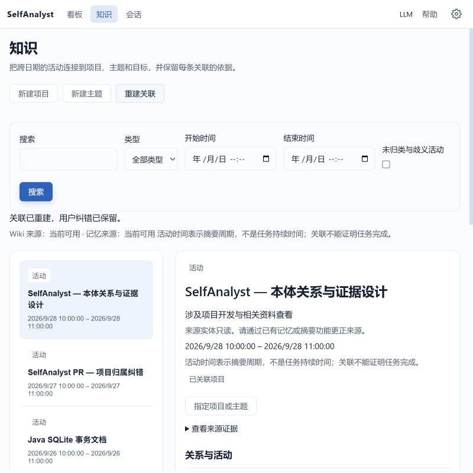

# 0.6 本体验证记录

变更：`add-personal-ontology-v06`。测试数据均为临时目录中的合成记录；浏览器验收不启用采集器或外部模型。

## 行为与证据

| 规格 | 实现与验证证据 |
|---|---|
| SPEC-ONTO-001 实体关系 | Ontology 类型/谓词校验；OntologyServiceTest 的非法变更、同类型合并、重定向和重启测试；DesktopOntologyHttpTest 的真实 HTTP CRUD |
| SPEC-ONTO-002 证据 | OntologySourcesTest 验证不同 Wiki 条目 f1 引用隔离、缺失引用不可用；浏览器展开事实引用；Agent 提示词和界面说明不将关联升级为完成 |
| SPEC-ONTO-003 身份解析 | 跨应用、跨日期别名归类及歧义回归；Unicode/Latin 词边界；未归类视图与手工指定 |
| SPEC-ONTO-004 纠错 | 拒绝/确认在重建、重启、合并后保留；缓存失效回归；浏览器实际保存关联后执行重建，详情仍显示用户确认 |
| SPEC-ONTO-005 来源失效 | 删除记忆、失效 Wiki 和来源读取失败回归；旧统计口径排除；查询前读取当前来源 |
| SPEC-ONTO-006 查询 | 核心分页/时间范围测试，工具 60000 字符预算；来源 5000 条截断及多应用导致关系先达上限的回归测试；界面标注周期范围而不生成项目耗时 |
| SPEC-ONTO-007 目标模式 | legacy 目标/模式/改进投影和孤立 goalId 测试；类型化关系正反向详情测试 |
| SPEC-ONTO-008 持久化 | SQLite 写失败回滚、未知版本/损坏库保留、重启回归；RuntimeStorageCompatibilityTest 验证只读接纳不改变业务字节；真实 DesktopServer 损坏本体故障隔离 |
| SPEC-ONTO-009 桌面 | ontology.test.mjs：安全文本、空/失败、竞态、保存失败保留输入、关系提交、本地化；真实浏览器正常与 800×800 窗口验收 |
| SPEC-ONTO-010 Agent | OntologyTools 的有界只读响应与降级测试；LlmHotReloadIntegrationTest 核对替换前后模型请求均包含两个本体工具 |
| SPEC-ONTO-011 隐私 | Wiki/Memory 只读适配，过滤禁用应用、敏感/凭据记忆，不依赖事件正文/文件模块/外部模型；无模型 DesktopServer 实测可创建项目 |
| SPEC-ONTO-012 版本 | resolve-release-channel.ps1 -Tag v0.6.0；双语 README 与本体指南；可执行 JAR 隔离启动冒烟 |

## 本地命令

- `mvn test`：全模块 Java 与桌面 Node 测试通过。
- 最终兼容/缓存变更后，针对 `RuntimeStorageCompatibilityTest,OntologyServiceTest,OntologySourcesTest,DesktopOntologyHttpTest,LlmHotReloadIntegrationTest` 再次回归通过；桌面 Node 共 198 项通过。
- `cargo test --manifest-path self-analyst-desktop/src-tauri/Cargo.toml --locked`：36 项通过；desktop 与 sidecar 格式检查通过。
- `cargo test --manifest-path self-analyst-axsidecar/Cargo.toml --locked`：编译及测试命令成功，该目标没有测试用例。
- `mvn package -DskipTests` 与 `scripts/check-packaged-jar.ps1`：构建和隔离启动通过。
- `openspec validate --all --strict`：31 个主规格及本 change 通过；主规格已同步。
- README 完整差异检查：英文新增正文为英文，中文对应功能与限制已同步。

## 界面证据

截图使用 OntologyReviewServer 合成数据与真实本体后端。该入口仅位于测试源码，不在正式 JAR 的启动链路中。

## 交付检查

远端检查以 PR 最新提交为准，本地成功不替代 Windows 全量验证。提交后在 PR 记录远端结果；合并与正式 tag/release 发布需遵循用户授权。

实现提交 d763be4 的远端 CI 已全部通过，包括 Windows 全量验证及三平台数据守卫：[运行记录](https://github.com/chunleik/self-analyst/actions/runs/36504414653)。PR 为 [#76](https://github.com/chunleik/self-analyst/pull/76)。归档提交仍以 PR 最新检查为最终依据。
