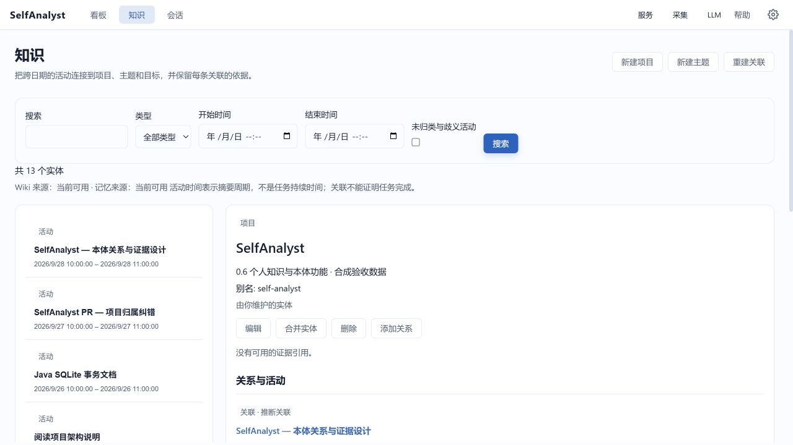

# 个人知识与本体（0.6）

“知识”把项目、活动、应用、主题、目标、行为模式与改进记录组织成可查询的实体与关系。它建立在已有 Wiki 和记忆上，使用标题派生信息；不读取普通文件正文，不恢复 OCR/UIA 原文，不额外调用模型。

## 开始使用

1. 打开顶部“知识”，点击“新建项目”或“新建主题”。填写名称、说明和别名（每行一个，最多 30 个）。
2. 系统使用活动标题/描述匹配名称或别名。唯一项目命中显示为推断关联，多个项目命中显示为歧义候选；没有命中保持未归类。
3. 选择实体查看关系、活动周期和来源证据。使用类型、名称、开始/结束时间过滤，并通过上一页/下一页继续查看。
4. 勾选“未归类与歧义活动”，进入活动详情并“指定项目或主题”，可搜索和选择目标。用户指定项目优先于自动匹配。

英文界面的入口为 Knowledge。所有表单支持 Tab 和键盘提交；名称、描述与证据按纯文本显示。

## 关系与证据

活动可以关联项目、涉及主题、使用应用；项目可以支持目标；模式可以关联项目/主题；改进记录按已有 goalId 关联目标。添加关系不会自动改变目标状态。

- **推断关联**：名称/别名规则或 Wiki 分类提供的关联线索，不证明任务已完成。
- **用户确认关联**：你确认的是关系本身，仍不代表项目完成、目标达成或因果关系。
- **歧义候选**：可能属于多个项目，尚未确定，不计入某个项目的已接受活动列表。
- **来源记录**：例如改进记录明确保存了 goalId；目标不存在时显示来源缺失，不创造虚假目标。
- **历史来源/证据缺失**：旧摘要可能没有事实引用。不能将缺失证据解释为已验证。

证据引用带 Wiki 条目命名空间，可区别不同条目里的同名事实 ID。证据详情显示允许的应用/标题与引用；当前不可解析或隐私过滤的引用显示不可用。应用与任务分类来自既有 Wiki，不能通过关联传递提高断言强度。

活动的开始/结束时间是摘要所属周期，不是任务精确起止时间。0.6 不显示由摘要周期相加得到的项目耗时。

## 纠错与合并

- 自动关系可以确认或移除；移除会持久化否定记录，重建不会重新建立同一关系。
- 为活动指定另一个项目会替换此前确认的项目归属；也可以关联多个主题。
- 手工项目/主题可以改名、编辑别名、删除或合并。合并只支持同类型手工实体，保留目标 ID，将别名、关系和纠错迁移到目标；旧 ID 可解析到目标。
- 合并无法直接撤销，提交表单前请核对目标。删除实体会删除其手工关系和相关决定，但不删除上游采集、Wiki 和记忆。
- 来源实体只读。项目、目标和模式记忆通过现有记忆能力更正或忘记；改进记录和 legacy 目标/模式保持已有来源权威。

## 来源新鲜度与覆盖

每次查询先检查当前来源。已停用/删除的记忆不再返回正文或自动关系；Wiki 失效或重算后旧活动退出查询。用户手工实体仍保留；只针对已消失活动 ID 的旧决定不会作用于新的不同片段。

本体优先采用细粒度摘要。与细粒度条目重叠的粗粒度摘要会省略并报告数量，避免重复解释同一活动。当前最多读取最近 5000 个有效摘要条目，投影实体最多约 20000 个、关系最多 100000 条；达到上限时明确显示部分覆盖。隐私过滤、缺失来源和被省略的粗粒度条目意味着结果不是完整活动记录。

没有配置模型时仍可管理实体和查询已有来源；不会因此生成新的 Wiki。Wiki 不可用时可查看手工实体和可用记忆，来源栏标明不可用。读取或存储失败时本体返回错误，不用旧来源正文伪装当前结果，采集、聊天和摘要继续可用。

## 重建、备份与恢复

点击“重建关联”重新读取允许来源并原子替换投影，不重算历史 Wiki。用户实体、别名、关系确认/否定和合并记录保留；失败不会部分清空用户决定。

数据位于配置 memory 目录下的 `ontology.db`。该库同时保存必须备份的用户决定和可重建的来源投影；**不要为重建直接删除数据库**。完全退出应用后备份整个用户数据根，包含事件库、Wiki、memory.json 与 ontology.db。恢复时也在完全退出后进行，保持来源与用户数据一致。未知版本或损坏库会报告不可用并保留文件，不自动以空库覆盖。

从 0.5 升级时初始化独立本体库，不破坏性迁移事件、Wiki 和记忆。回退到 0.5 时保留 ontology.db，以便再次升级后继续使用。

## 聊天查询

可以询问“这个项目最近有哪些活动”“哪些主题与这个项目有关”“为什么把这段活动关联到这个项目”。Agent 使用 `searchOntology` 和 `inspectOntology` 只读工具，按页获得有界结果，并保留推断、歧义和证据不足说明；本体不可用时可回退 Wiki。工具不执行实体或关系修改，纠错在“知识”界面明确提交。

## 可选 Neo4j 快照

“配置 → Neo4j 同步”提供默认关闭的 Neo4j 手工同步。配置完成后，每次都需确认目标数据库、独占命名空间和发送范围，
才会发送当前有效且已应用纠错的有界图快照；页面筛选不会限制发送范围。快照包含手工项目/主题、别名、合并身份、
最终关系、允许的来源/证据文本和覆盖信息，可能带有私密标题与用户描述。

本地 SQLite、memory.json、Wiki 与 Lucene 继续保持现有权威和查询边界，同步不调用模型、不迁移向量、不替代备份。
保存配置、刷新状态和重建都不自动连接 Neo4j。远端只有在下次成功手工同步后才反映删除或来源失效；关闭功能不删除
远端副本，更换命名空间也保留旧副本。配置、容量限制、墓碑语义和只读 Cypher 示例见 [Neo4j 同步指南](neo4j-sync.md)。
